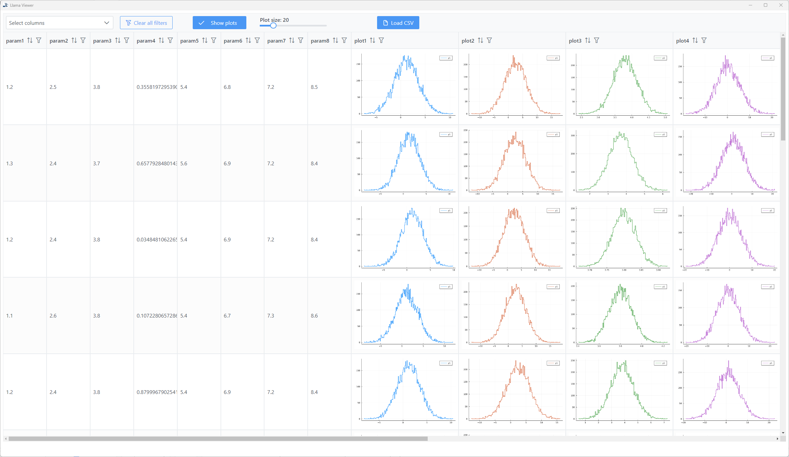

# Llama-Viewer

## Llama - Llama Logs All My Analyses

**Hi, I'm Llama and I will help you log your analyses so you can keep track of all of them.**

The **Llama Viewer** is an electron app that allows you to interactively explore the results of your logging (see [Llama.jl](https://github.com/Cornelius-G/Llama.jl) and [Llama.py](https://github.com/Cornelius-G/Llama.py) for how to generate logs). 
It gives you an overview of your logged analyses and lets you sort and filter them as well as allow to inspect plots, so you quickly find what you are looking for.

---
**NOTE**

**Llama Viewer** will soon be available as executables for Windows, macOS and Linux. 
In the meantime, you can run it with Node.js as described below.

---

## Installation

1) Download the [Node.js installer for your operating system](https://nodejs.org/en/download/) and install it according to the documentation.
2) Download or clone the `Llama-Viewer` repository to your filesystem.
3) Go into the `Llama-Viewer` folder and run `npm install` in your terminal.

## Usage
1) Go into the `Llama-Viewer` folder and run `npm start` in your terminal.  
The `Llama-Viewer` app should start and you can select a `.csv` file to load.  
(A documentation on how to create the corresponding `.csv` files can be found at [Llama.jl](https://github.com/Cornelius-G/Llama.jl) or [Llama.py](https://github.com/Cornelius-G/Llama.py).)

